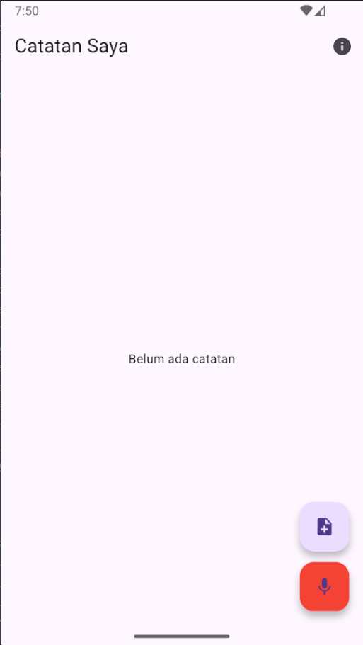
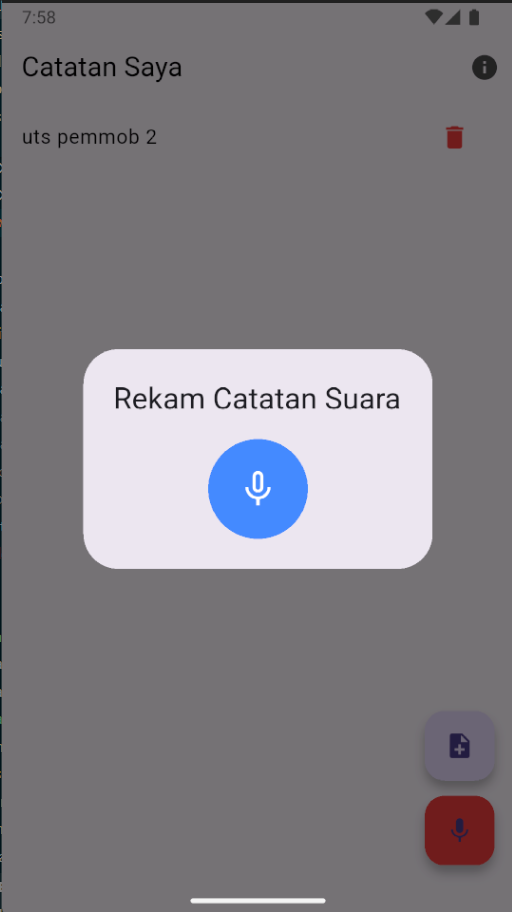
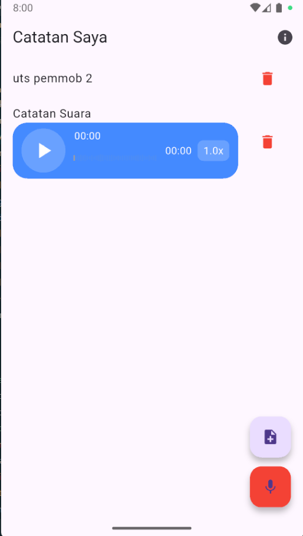

# 📝 Flutter Note App
Aplikasi catatan sederhana yang memiliki fitur text note, voice note, notifikasi, dan tampilan yang bersih.

---

## 📌 Fitur Utama
- ✏️ Menambah & mengedit catatan (Text Note)
- 🎤 Merekam voice note
- 🔔 Notifikasi pengingat
- 📁 Penyimpanan lokal
- 📱 SplashScreen, Login, Register
- 📄 Halaman About

---

# 📷 Screenshot Aplikasi

## 🏠 **Halaman Home**
WEB_HOMEPAGE  

---

## ➕ **Tambah Catatan (Text Note)**
WEB_ADDNOTE  

---

## 🔊 **Voice Note**
NOTEVOICE  

### Setelah voice note berhasil ditambahkan
NOTEVOICEADDED  

---

## 📝 **Detail Catatan**
NOTE  

---

## 🔔 **Notifikasi**
WEB_NOTIF  

---

## 🔐 **Permission Record**
WEB_PERMISSION  

---

## ℹ️ **About Page**
WEB_ABOUT  

---

